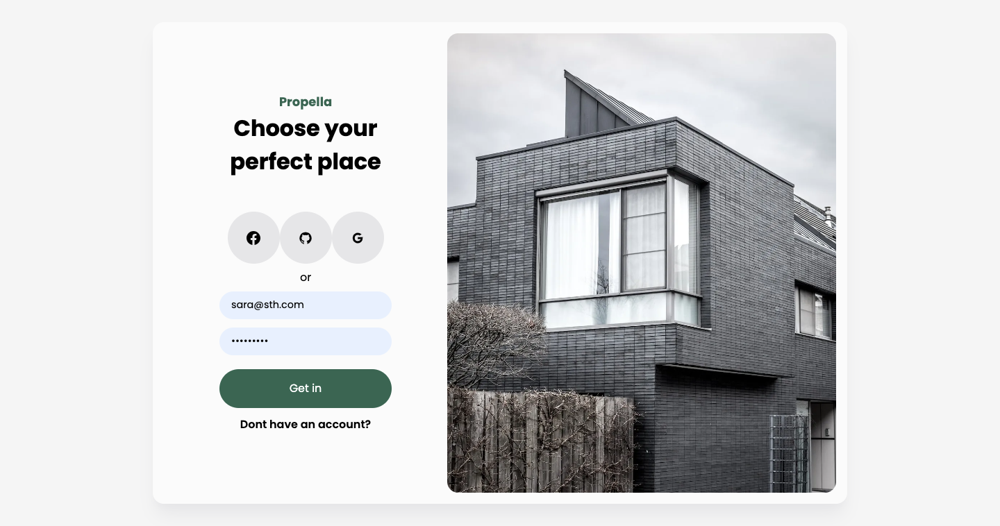
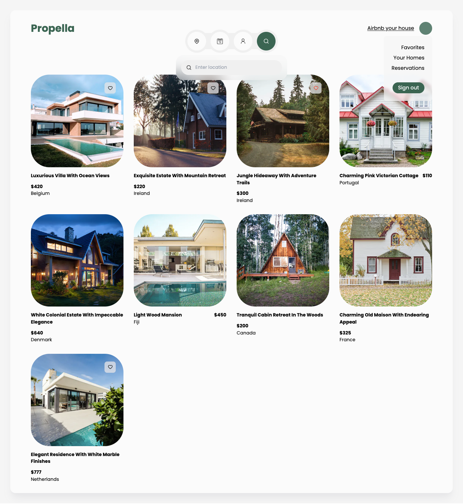
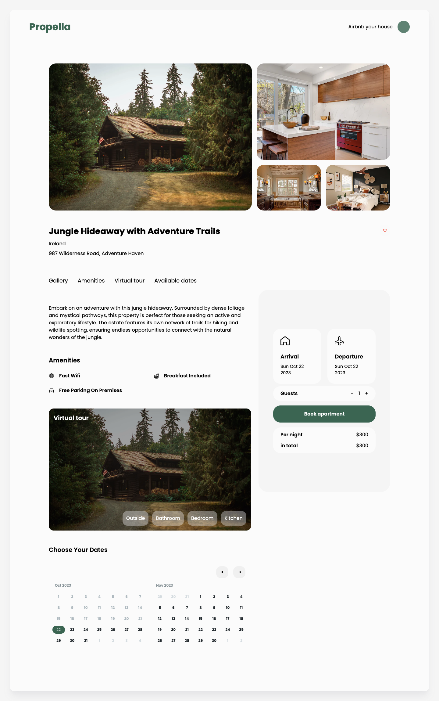

# Propella

This real estate app is coded using NextJS 13 (app directory) + Prisma and MongoDB.

## You can:

- Sign up using credentials or your Github/Facebook/Google account
- View properties added by other users
- Search for a specific property
- Favorite/reserve properties
- Create your own properties

## Screenshots

## Built with

- NextJS 13
- Prisma and MongoDB

## To Do

- The calendar doesn't have a purpose in searching
- Better looking modal with steps
